class: center,middle

---
class: center,middle

[uswitch.com](http://www.uswitch.com)
---
# Escaping DSL hell by having parenthesis all the way down

---

# DSL

---

# Problems with Puppet

---
# Namespaces?
## module foo
```puppet
class fooapp {
  exec { 'install':
    command     => '/install/foo',
  }
}
```

## module bar
```puppet
class barapp {
  exec { 'install':
    command     => '/install/bar',
  }
}
```
---
# Iteration
```puppet
file { ["/root/one","/root/two"]:
  ensure => present
}


nagios_host { ["first", "second"]:
  use => 'generic-host',
}

```

---
# But you need to know ruby anyway...
```ruby
Puppet::Type.type(:file).provide(:posix) do
    desc "Normal Unix-like POSIX support for file management."

    def create
        File.open(@resource[:name], "w") { |f| f.puts "" } # Create an empty file
    end

    def destroy
        File.unlink(@resource[:name])
    end

    def exists?
        File.exists?(@resource[:name])
    end
end
```
---
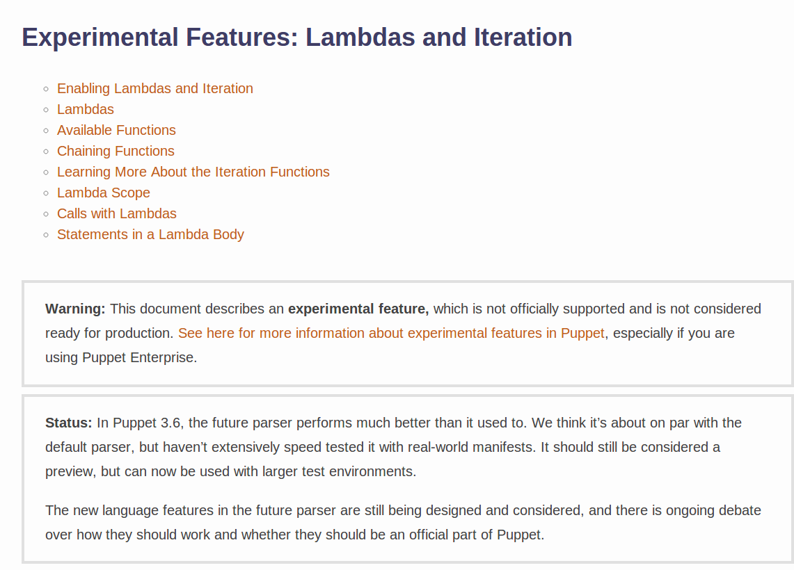

---

# Ansible is just YAML...

```yaml
---
- name: Create Instance
  hosts: localhost
  roles:
    - role: ec2_ubuntu_instance
      security_groups: ['all-servers', 'comms', 'commsinternal' ]
      role_name: "commsinternal"
      count: 2
      elastic_ip: True
      zones:
        - a
      subnet_type: private
      instance_type: c1.medium
  tasks:
    - ec2_tag: resource="{{ item.1.id }}" region="{{ region }}" state=present
      with_subelements:
        - ec2.results
        - tagged_instances
      args:
        tags:
          Stages: "production"
```

---

# If you give people a 'language' they will expect loops

- maybe lambdas
- probably namespaces

This has been done before...

---
# Chef gets it right
If you can do
```ruby
file "/path/to/somefile" do
  action :create
end
```
then you can do
```ruby
filepath = "/some/path/or/other"

["one", "two"].each do |filename|
  file "#{filepath}/#{filename}" do
    action :create
  end
end
```
---
# Teaching people to program

---
class: center,middle
# Geomlab
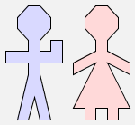

## man $ woman

---
class: center,middle
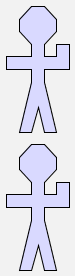

## man & man
---
class: center,middle
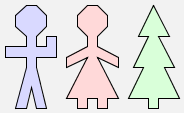

## (man $ woman) $ tree

## man $ (woman $ tree)
---
class: center,middle
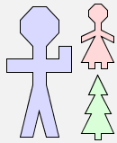

## man $ (woman & tree)

---
class: center,middle
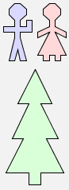

## (man $ woman) & tree

## man $ woman & tree

---
class: center,middle
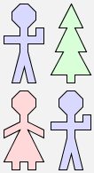

## (man $ tree) & (woman $ man)

## (man & woman) $ (tree & man)

---
class: center,middle
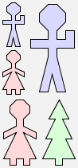
## ((man & woman) $ man) & (woman $ tree)

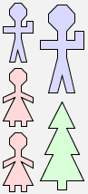
## ((man & woman) & woman) $ (man & tree)

---
class: center,middle
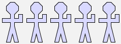
```haskell
define manrow(n) = manrow(n-1) $ man when n > 1
  | manrow(1) = man
```
---
class: center,middle
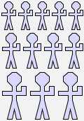
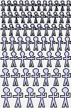

---
class: center,middle
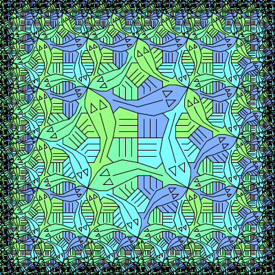

---
# Where do we go now?
---
# What if we did it in Clojure(script)?
```clojure
(below man
       woman)

(beside man (below tree
                   star))
```
---
class: center,middle
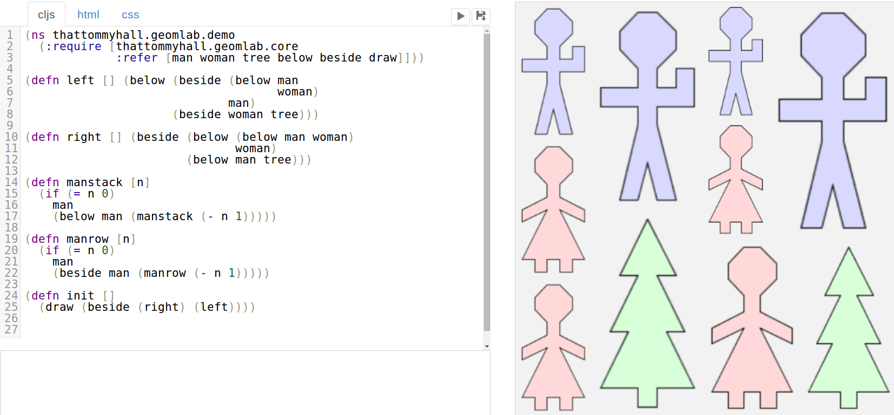
---
```clojure
(ns thattommyhall.geomlab.demo
  (:require [thattommyhall.geomlab.core
             :refer [man woman tree below beside draw]]))

(defn left [] (below (beside (below man
                                    woman)
                             man)
                     (beside woman tree)))

(defn right [] (beside (below (below man woman)
                              woman)
                       (below man tree)))

(defn init []
  (draw (beside (right) (left))))
```

---
# What's easier to learn?

```haskell
define manrow(n) = manrow(n-1) $ man when n > 1
  | manrow(1) = man
```
OR
```clojure
(defn manrow [n]
  (if (= n 0)
    man
    (beside man (manrow (- n 1)))))
```
---
# Extension?
---
class: center,middle


---
class: center,middle


---
```logo
to wiggle
  rt random 40
  lt random 40
  if not can-move? 1 [ rt 180 ]
end

to go
  ask turtles
  [ wiggle
    fd 1 ]
  tick
end
```

```clojure
(defn move [t]
  (fd t 1)
  (rt t (rand 60))
  (lt t (rand 60)))

(go
 (loop []
   (<! (timeout 10))
   (doseq [t turtles]
     (move t))
   (recur)))
```

---
# Conclusion
* You probably dont need to make a new language
* If you do it will probably be rubbish
* * At least for a while
* Think about its power and reach

## You should embed *deeply* into clojure
---
class: center,middle
### Thanks Euroclojure!


---
## Slides
* http://www.thattommyhall.com/euroclojure2014/slides.pdf

## Geomlab
* http://www.twitter.com/otfrom
* http://cljsfiddle.net/fiddle/thattommyhall.geomlab.core
* http://cljsfiddle.net/fiddle/thattommyhall.geomlab.demo
* http://cljsfiddle.net/fiddle/thattommyhall.geomlab.bruce

## Netlogo
* http://www.complexityexplorer.org/
* http://cljsfiddle.net/fiddle/thattommyhall.ants.core
* http://ccl.northwestern.edu/tortoise/2013-10-25/Ants.html

## Slideshow Template
* https://github.com/thattommyhall/presentation-template
